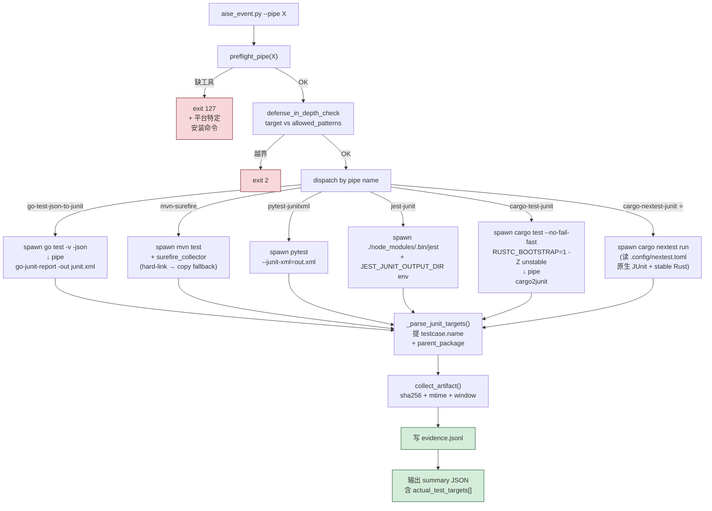
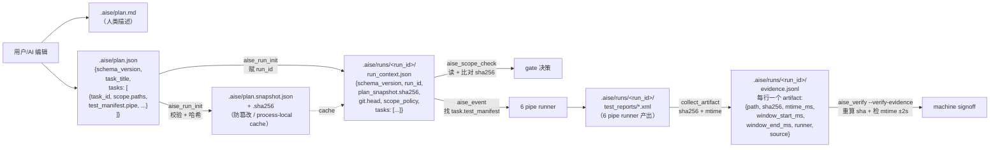
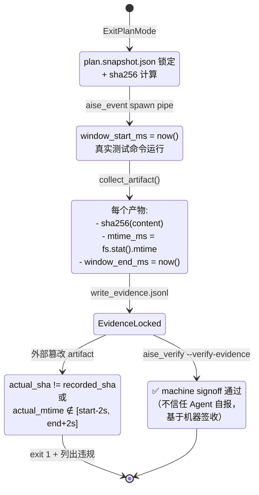
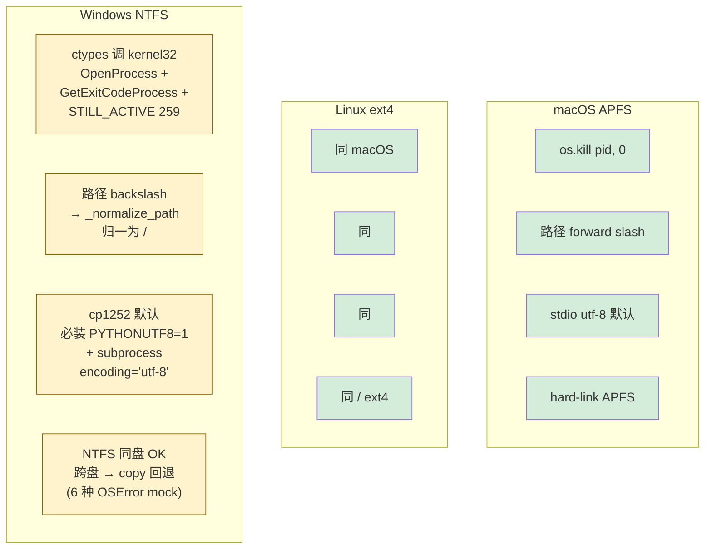

# AISE 架构图（v3.6.0）

> Mermaid 图（GitHub 原生渲染），描述 AISE 5 层组件 + 三阶段闭环 + 数据流。

---

## 1. 整体架构（5 层）

```mermaid
graph TB
    subgraph U["用户层"]
        User["Claude Code 用户<br/>/aise &lt;任务描述&gt;"]
    end

    subgraph O["编排层（aise- 前缀 Skills + slash command）"]
        Cmd["commands/aise.md<br/>9 阶段编排"]
        SK1["aise-brainstorming"]
        SK2["aise-test-driven-development"]
        SK3["aise-ce-review"]
        SK4["aise-planning-with-files"]
        SK5["aise-verification-before-completion"]
        SK6["aise-ce-compound"]
    end

    subgraph G["三阶段闭环 Gate（v3.3 架构）"]
        G1["1️⃣ aise_run_init.py<br/>plan 校验 + run_id 分配<br/>+ snapshot 锁"]
        G2["2️⃣ aise_scope_check.py<br/>git diff vs task.scope.paths<br/>越界 → exit 1"]
        G3["3️⃣ aise_event.py<br/>6 pipe runner 调度<br/>+ evidence 签收"]
        G4["4️⃣ aise_verify.py<br/>--verify-evidence<br/>machine signoff"]
    end

    subgraph E["执行层（6 pipe runner）"]
        P1["go-test-json-to-junit"]
        P2["mvn-surefire"]
        P3["pytest-junitxml"]
        P4["jest-junit"]
        P5["cargo-test-junit"]
        P6["cargo-nextest-junit ⭐"]
    end

    subgraph L["lib/ 共用 helper（11 模块）"]
        L1["lock.py<br/>跨平台 mkdir 锁<br/>+ Windows ctypes pid"]
        L2["event_runner.py<br/>PIPE_DEFS + preflight<br/>+ defense_in_depth<br/>+ resolve_runtime_bin"]
        L3["target_cover.py<br/>cross-kind 桥接<br/>testcase → package"]
        L4["evidence.py<br/>sha256 + mtime<br/>+ 生成窗口签收"]
        L5["snapshot.py<br/>plan.snapshot 防篡改<br/>+ process-local 缓存"]
        L6["preflight.py / surefire_collector.py /<br/>region_detect.py / mirror_config.py /<br/>ansi.py / version_check.py"]
    end

    subgraph S["状态层 .aise/"]
        S1["plan.json + plan.md<br/>（人类 + 机器双源）"]
        S2["plan.snapshot.json<br/>+ .sha256<br/>（防篡改快照）"]
        S3["runs/&lt;run_id&gt;/<br/>├── run_context.json<br/>├── evidence.jsonl<br/>└── test_reports/*.xml"]
    end

    User --> Cmd
    Cmd --> SK1
    Cmd --> SK2
    Cmd --> SK3
    Cmd --> SK4
    Cmd --> SK5
    Cmd --> SK6

    Cmd --> G1
    G1 --> G2
    G2 --> G3
    G3 --> G4

    G3 -->|spawn| P1
    G3 -->|spawn| P2
    G3 -->|spawn| P3
    G3 -->|spawn| P4
    G3 -->|spawn| P5
    G3 -->|spawn| P6

    G1 -.read.-> S1
    G1 -.write.-> S2
    G1 -.write.-> S3
    G2 -.read.-> S2
    G2 -.read.-> S3
    G3 -.write.-> S3
    G4 -.read.-> S3

    G1 -.uses.-> L1
    G1 -.uses.-> L5
    G3 -.uses.-> L2
    G3 -.uses.-> L4
    G3 -.uses.-> L6
    G4 -.uses.-> L4
    G4 -.uses.-> L5

    classDef gate fill:#fff3cd,stroke:#856404
    classDef pipe fill:#d1ecf1,stroke:#0c5460
    classDef lib fill:#e8e8e8,stroke:#333
    classDef state fill:#d4edda,stroke:#155724
    class G1,G2,G3,G4 gate
    class P1,P2,P3,P4,P5,P6 pipe
    class L1,L2,L3,L4,L5,L6 lib
    class S1,S2,S3 state
```



---

## 2. 三阶段闭环流程（核心）

```mermaid
sequenceDiagram
    autonumber
    participant U as 用户
    participant CC as Claude Code
    participant SK as Skills
    participant RI as aise_run_init
    participant SC as aise_scope_check
    participant EV as aise_event
    participant VF as aise_verify
    participant FS as .aise/

    U->>CC: /aise 给 X 加 Y 功能
    CC->>SK: brainstorming → requirements
    CC->>U: EnterPlanMode（用户审查）
    U-->>CC: ExitPlanMode（批准 plan.json）

    Note over CC,FS: 阶段 1: run_init
    CC->>RI: --project-root + --task-title-override
    RI->>FS: 读 plan.json
    RI->>RI: schema 校验<br/>(task_id 唯一 / scope 非空 /<br/> pipe 合法 / deps 无环 /<br/> shared_evidence scope 相交)
    RI->>FS: 写 plan.snapshot.json + .sha256
    RI->>FS: 写 runs/&lt;run_id&gt;/run_context.json
    RI-->>CC: run_id

    Note over CC,FS: TDD 任务执行（SubAgent + worktree）
    CC->>SK: aise-test-driven-development
    SK->>SK: Red → Green → Refactor

    Note over CC,FS: 阶段 2: scope_check
    CC->>SC: --task-id T-001
    SC->>FS: 读 runs/&lt;run_id&gt;/run_context.json
    SC->>SC: 校验 plan.snapshot.sha256<br/>（process-local cache）
    SC->>SC: git diff + ls-files<br/>vs task.scope.paths
    alt 越界
        SC-->>CC: exit 1 + 违规文件列表
        CC->>CC: worker 回退非范围内改动
    end
    SC-->>CC: exit 0

    Note over CC,FS: 阶段 3: event runner
    CC->>EV: --pipe pytest-junitxml --run-id
    EV->>EV: preflight_pipe（缺工具 exit 127）
    EV->>EV: defense_in_depth_check<br/>（target vs white-list）
    EV->>EV: spawn 真实测试命令
    EV->>FS: 写 test_reports/junit.xml
    EV->>FS: 写 evidence.jsonl<br/>(path + sha256 + mtime + window)
    EV-->>CC: actual_test_targets[]

    Note over CC,FS: 阶段 4: verify (machine signoff)
    CC->>VF: --verify-evidence
    VF->>FS: 读 evidence.jsonl
    VF->>VF: 重算每个 artifact 的 sha256
    VF->>VF: 检查 mtime 仍在 ±2s 窗口
    alt 篡改
        VF-->>CC: exit 1 + 违规项
    end
    VF-->>CC: exit 0（机器签收通过）

    CC->>SK: aise-ce-review（多 persona 审查）
    CC->>SK: aise-ce-compound（沉淀 patterns）
    CC-->>U: 任务完成（含 commit + diff）
```

---

## 3. 6 pipe runner 内部分发



---

## 4. 数据流：plan.json → run_context → evidence



---

## 5. machine signoff 防篡改窗口



---

## 6. 跨平台关键差异（v3.3 P0 实战验证）



---

## 相关文档

- [`aise-guide.md`](aise-guide.md) — v3.6 实施指南（用户视角）
- [`plan-schema.md`](plan-schema.md) — plan.json schema v1.0
- [`tutorial.md`](tutorial.md) — 使用教程（step-by-step）
- [`tool-compatibility-matrix.md`](tool-compatibility-matrix.md) — 6 pipe 版本支持
- [`v3.4-6-completion-report.md`](v3.4-6-completion-report.md) — v3.6 完成度

---

_本架构图由 AISE 团队维护。v3.6.0 截图。_
